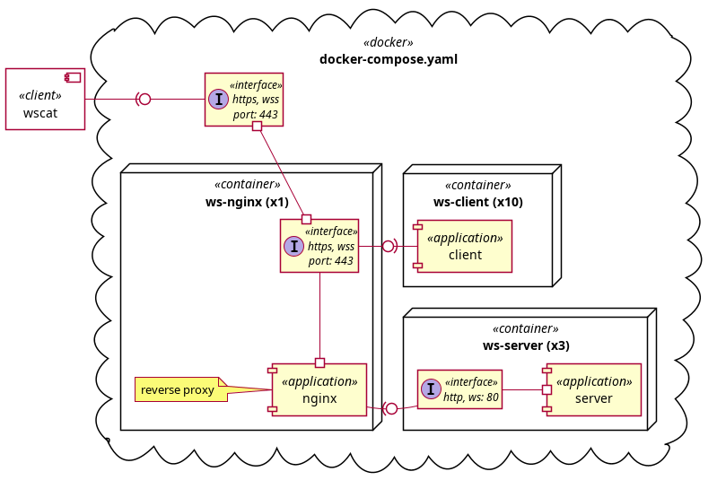

# WebSocket на Go: от эксперимента до production-ready решения


# Введение

Когда речь заходит о WebSocket, многие думают: «Ну это же просто протокол для real-time связи, что там сложного?»

А потом начинаются вопросы:

- Почему соединения рвутся через минуту?
- Как настроить таймауты между клиентом, прокси и сервером?
- Какую библиотеку выбрать — и почему это вообще важно?
- Как масштабировать и балансировать stateful-соединения?

WebSocket - это не просто протокол. Это целая экосистема, где критически важны выбор языка, библиотек, настройка прокси и понимание того, как всё это работает под реальной нагрузкой.

В этой статье - практический эксперимент: как создать и протестировать WebSocket-сервис на Go, Nginx и Docker, способный держать десятки тысяч одновременных соединений.

[Репозиторий проекта](https://github.com/arootcom/websocket/tree/step1)

## Почему Go?

Для проверки гипотезы о взаимодействии множества WebSocket-клиентов выбор языка — это не просто предпочтение, а критический фактор успеха.

### 1. Эффективное управление конкурентностью

Горутины (goroutines) — главное оружие Go в борьбе за ресурсы:

- Легковесность: одна горутина занимает всего несколько килобайт памяти
- Масштабируемость: 50 000 активных клиентов на одной стандартной виртуальной машине — реальность, а не мечта

Попробуй сделать то же самое с классическими потоками (threads) — упрёшься в нехватку ресурсов гораздо раньше.

### 2. Производительность сетевого стека

Go создавался для облачных сервисов и высоконагруженных сетей. Стандартная библиотека даёт:

- Низкие задержки при обработке фреймов
- Прямой доступ к системным вызовам без лишних абстракций
- Высокую скорость сериализации/десериализации данных

### 3. Контроль над жизненным циклом соединений

В Go легко реализовать сложную логику поведения реального пользователя:

- Управление таймаутами и корректное завершение соединений
- Точный контроль Keep-Alive и Ping/Pong запросов
- Проверка устойчивости соединений через Nginx

# Архитектура эксперимента

## Контур тестирования



Мы создаём изолированное окружение с помощью Docker Compose:

```
$ docker-compose up -d --scale ws-server=3 --scale ws-client=10
```
Что это даёт?

- 3 экземпляра WebSocket-сервера (масштабирование)
- 10 клиентов-генераторов нагрузки
- Nginx как прокси-слой между ними

# Задачи эксперимента

1. Выбрать вариант реализации WebSocket на уровне Nginx
2. Оптимизировать таймауты (WebSocket Ping) под связку Docker + Nginx
3. Настроить TLS/SSL (WSS)
4. Реализовать мониторинг соединений на уровне Nginx
5. Настроить балансировку нагрузки
6. Определить максимальный размер передаваемых данных
7. Внедрить сжатие текстовых сообщений (permessage-deflate)
8. Выбрать оптимальную библиотеку Go для WebSocket

# Nginx: какой вариант настройки выбрать?

Рассмотренные варианты:

1. njs (Nginx JavaScript). Современный способ с модулем ngx_http_js_module для асинхронных HTTP-запросов.
2. OpenResty + lua-nginx-module. Стандарт для сложной логики с библиотекой lua-resty-websocket.
3. Nginx как простой Reverse Proxy. ✅ Nginx пробрасывает WebSocket до бэкенда (Go), где происходит основная логика.
4. Nginx как API Gateway + Keycloak. Умный фильтр с проверкой прав доступа через auth_request.

Наш выбор: вариант 3 (простой Reverse Proxy)

Почему?

✅ Простота поддержки: декларативная конфигурация легко читается и проверяется

✅ Меньше багов: нет программного кода в конфиге — нет runtime-ошибок

✅ Минимальный Overhead: не нужно инициализировать виртуальные машины (Lua VM или V8)

✅ Предсказуемые задержки: обработка нативными модулями C быстрее интерпретируемого кода

✅ Безопасность: меньше зависимостей = меньше площадь атаки

✅ Быстрые обновления: оригинальный Nginx получает патчи безопасности быстрее форков

# Выбор библиотеки Go для WebSocket

Сравнение трёх лидеров:

| Характеристика | gorilla/websocket | coder/websocket | gobwas/ws |
|---|---|---|---|
| Стиль API | Традиционный (callbacks) | Современный (Context) | Низкоуровневый (Zero-copy) |
| Производительность | Средняя | Высокая | Максимальная |
| Поддержка Context | ❌ Нет | ✅ Да (нативная) | ❌ Нет (нужно оборачивать) |
| Статус проекта | Архивный / Стабилен | Активно поддерживается | Активен |
| Сложность освоения | Низкая | Низкая | Высокая |
| permessage-deflate | Частичная | Полная | Опциональная |

✅ Наш выбор: gorilla/websocket

Почему?

Для большинства задач этой библиотеки достаточно. Она стабильна, проста в освоении и имеет огромное комьюнити.

> [!NOTE]
> Для новых проектов рекомендуем coder/websocket — это «золотая середина» с современным API и полной поддержкой Context.

# Пошаговая реализация

## Шаг 1: Базовая настройка Nginx для WebSocket

Чтобы Nginx понимал WebSocket, необходимо явно передать заголовки Upgrade и Connection:

```
http {
    map $http_upgrade $connection_upgrade {
        default upgrade;
        ''      close;
    }

    server {
        ...

        location /ws-notifications/ {
            proxy_pass http://backend;
            proxy_http_version 1.1;
            proxy_set_header Upgrade $http_upgrade;
            proxy_set_header Connection $connection_upgrade;
            ...
        }
    }
}
```

## Шаг 2: Отключить буферизацию

> [!NOTE]
> Самая важная настройка для WebSocket!

Если буферизация включена (proxy_buffering on), Nginx будет накапливать данные в буфер перед отправкой клиенту огромные задержки.

```
location /ws-notifications/ {
    ...
    # Отключаем буферизацию, чтобы сообщения улетали мгновенно
    proxy_buffering off;
    ...
}
```

## Шаг 3: Настроить таймауты

По умолчанию Nginx закроет соединение через 60 секунд молчания. Для WebSocket это критично!

```
location /ws-notifications/ {
    ...
    # Запас в Nginx (90с) гарантирует, что если пакет задержится
    # на 5-10 секунд, прокси не обрубит связь "кодом 1006"
    proxy_read_timeout 90s;
    proxy_send_timeout 90s;
    ...
}
```

> [!NOTE]
> Важно: Nginx должен иметь proxy_read_timeout больше, чем ваш pongWait в Go, иначе он убьёт соединение раньше.

## Шаг 4: Настроить Ping/Pong на стороне сервера (Go)

```
const (
    // Время на отправку сообщения
    // Дает больше времени сетевому стеку на очистку буферов при временных затыках.
	writeWait = 15 * time.Second        // 15 сек
    // Сколько ждем ответа от клиента
	pongWait = 60 * time.Second         // 60 сек
    // Пингуем чаще, чтобы Nginx не закрыл сокет
    // Чем чаще пинг, тем быстрее вы узнаете о разрыве
	pingPeriod = 30 * time.Second       // 30 сек
)
```

Зачем это нужно?

✅ Проверка работоспособности соединения

✅ Сброс таймаута Nginx

✅ Быстрое обнаружение разрыва связи

## Шаг 5: Всегда устанавливать дедлайны

> [!NOTE]
> Критически важно!

Без дедлайна WriteMessage может зависнуть навсегда → утечка горутин.

```
    for {
        select {
            case message := <-echo:
                ws.SetWriteDeadline(time.Now().Add(writeWait))
                if err := ws.WriteMessage(websocket.TextMessage,[]byte(message)); err != nil {
                    log.Println("EchoWriteMessageError:", err)
                    return
                }
            case <-pingTicker.C:
                ws.SetWriteDeadline(time.Now().Add(writeWait))
                if err := ws.WriteMessage(websocket.PingMessage, nil); err != nil {
                    log.Println("PingWriteMessageError:", err)
                    return
                }
        }
    }
```

## Шаг 6: Настроить WSS (WebSocket Secure)

Для локальной разработки используем самоподписанный сертификат:

```
$ mkcert localhost 127.0.0.1 172.18.0.1
```

Настройка Nginx:

```
server {
    listen 443 ssl;
    server_name localhost;

    ssl_certificate     /etc/nginx/localhost.pem;
    ssl_certificate_key /etc/nginx/localhost-key.pem;
}
```

## Шаг 7: Мониторинг соединений

Модуль stub_status покажет количество активных соединений:

```
location /status {
    stub_status;
}
```

Проверка:

```
$ curl -k  https://localhost/status
Active connections: 1
```

## Шаг 8: Балансировка WebSocket

> [!NOTE]
> WebSocket — это stateful протокол. Разорвать соединение = заставить клиента переподключаться.

Решение: sticky sessions через ip_hash:

```
upstream go_sockets {
    # Sticky sessions важны, если сервер хранит локальный стейт клиента
    ip_hash;

    server wsserver:8000;
}
```

Масштабирование через Docker Compose:

```
$ docker-compose up -d --scale ws-server=3
```

> [!NOTE]
> Магия DNS: Внутренний DNS Docker автоматически балансирует запросы к wsserver между всеми репликами.

## Шаг 9: Ограничение размера сообщений

Золотое правило:

- Для текста/JSON: не более 1–5 МБ
- Для бинарных данных: до 10–50 МБ

На стороне Go:

```
const (
    ...
    // ограничивает размер сообщения,
    // для защиты от DoS-атак (переполнения памяти)
    readLimit = 65536 // Ограничение на 64 КБ
    ...
)

func reader(ws *websocket.Conn, echo chan string) {
    ...
	SetReadLimit(readLimit)
    ...
}
```

На стороне Nginx:

```
location /ws-notifications {
    ...
    # Максимальный размер тела запроса (0 = без ограничений).
    # Помогает, если передаются очень большие начальные данные.
    client_max_body_size 0;

    # Размер буфера для чтения тела запроса.
    # Если данные больше 128k, Nginx запишет их во временный файл.
    client_body_buffer_size 128k;
}
```

> [!NOTE]
> Если в Go стоит SetReadLimit(65536), настройки Nginx не имеют практического смысла — Go «отрубит» клиента раньше.

## Сжатие данных (permessage-deflate)

Зачем? Текстовые данные (JSON, логи) сжимаются в 5–10 раз.

Включение в Go:

```
var (
    upgrader = websocket.Upgrader{
        ...
        // Позволяет определить, должен ли сервер сжимать сообщения
        EnableCompression: true,
        ...
    }
)
```

Уровни сжатия:

| Уровень | Описание |
|---|---|
| 1 (BestSpeed) | Минимум нагрузки на CPU, но размер уменьшится не сильно |
| 6 (Default) | Баланс между скоростью и качеством |
| 9 (BestCompression) | Максимальное сжатие, но сильная нагрузка на CPU |

Рекомендация:

✅ Для JSON и текста: уровень 1 или 2

✅ Если клиентов много: ставьте 1

✅ Если важна экономия трафика: ставьте 6

# Тестирование

Инструменты:

## 1. wscat (Node.js)

```
$ wscat -n -c wss://localhost/ws-notifications -P
```

## 2. websocat (для отправки больших файлов)

```
# Создаём тестовый файл 100 КБ
$ base64 /dev/urandom | tr -d '\n' | head -c 102400 > big_message.txt
```

```
# Отправляем
$ cat big_message.txt | websocat -v -k -B 200000 wss://localhost/ws-notifications
```

# Выводы

✅ Go — идеальный язык для высоконагруженных WebSocket-сервисов

✅ Nginx как простой Reverse Proxy — самый надёжный вариант

✅ gorilla/websocket достаточно для большинства задач

✅ coder/websocket — лучший выбор для новых проектов

✅ Таймауты, дедлайны и лимиты — критически важны

✅ Сжатие данных экономит трафик, но нагружает CPU — выбирай уровень 1–2

✅ Балансировка через ip_hash обязательна для stateful-соединений

#  Что дальше?

В следующей части разберём:

1. Как писать клиента на Go для нагрузочного тестирования
2. Как мониторить метрики WebSocket-соединений
4. Как интегрировать WebSocket с Keycloak для авторизации

